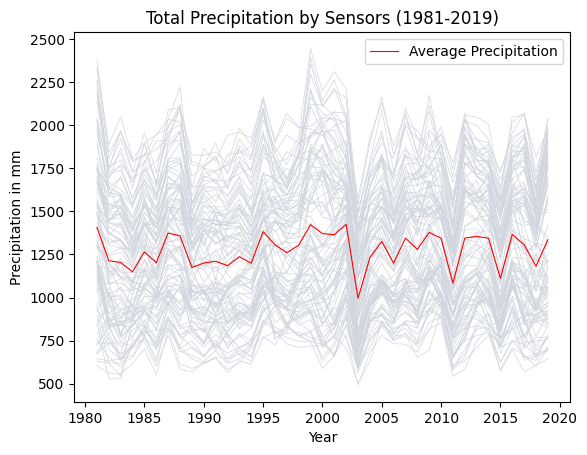
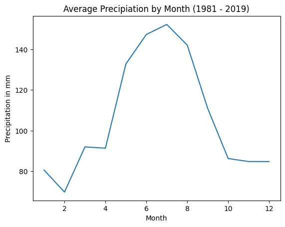
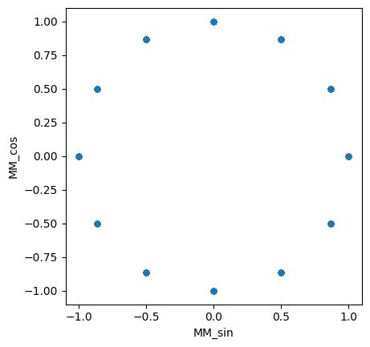
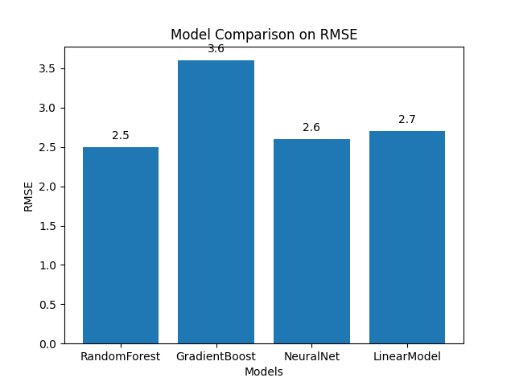

## Motivation

In the era of AI and ML, particularly in the context of climate change, applications range from predicting power demand in specific regions, forecasting future carbon emissions, to weather prediction. This project focuses on predicting precipitation for the next day. To achieve this, various machine learning algorithms (Linear Regression, Random Forest, Gradient Boosting, Neural Network) are trained on comprehensive time-series weather data from the LamaH dataset. LamaH (**La**rge-Sa**m**ple D**a**ta for **H**ydrology and Environmental Sciences) contains a combination of meteorological time series and hydrologically relevant attributes from over 859 catchments in Central Europe, covering Austria, Germany, the Czech Republic, Switzerland, Slovakia, Italy, Liechtenstein, Slovenia, and Hungary.

## Analysis of the target variable

The precipitation trend remains relatively stable between 1981 and 2019, although some outliers are present. Additionally, it is evident that the central region of Europe exhibits a clear seasonal pattern, with significantly higher precipitation in the summer months compared to winter.

To enhance the dataset, the seasonality has been cyclically encoded, ensuring that data for the winter months (January, February, and March) is treated differently from the summer months.

## Results

The results show that we achieve a very low RMSE, ranging from 2.5 mm to 3.6 mm, indicating a highly accurate prediction. This reflects both the quality of the dataset and the validity of the model assumptions, leading to strong predictive performance. Among the models tested, the Random Forest Regressor outperforms the others, followed by the Neural Network, Linear Regression, and Gradient Boosting models.