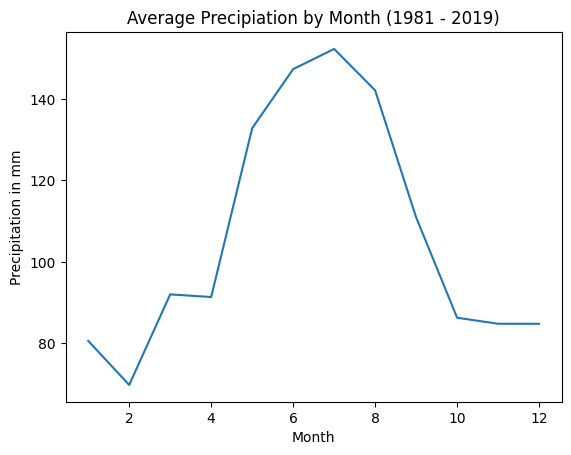

## Motivation

In the era of AI and ML, particularly in the context of climate change, applications range from predicting power demand in specific regions, forecasting future carbon emissions, to weather prediction. This project focuses on predicting precipitation for the next day. To achieve this, various machine learning algorithms are trained on comprehensive time-series weather data from the LamaH dataset. LamaH (**La**rge-Sa**m**ple D**a**ta for **H**ydrology and Environmental Sciences) contains a combination of meteorological time series and hydrologically relevant attributes from over 859 catchments in Central Europe, covering Austria, Germany, the Czech Republic, Switzerland, Slovakia, Italy, Liechtenstein, Slovenia, and Hungary.

## Analysis

## Results

